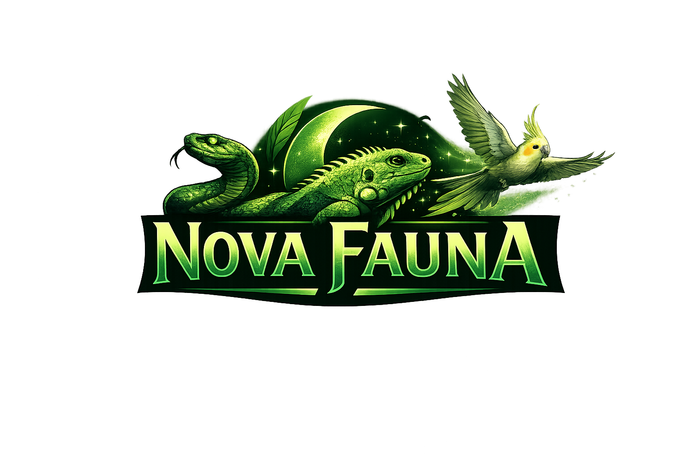

<div align="center">



<br/>
<br/>

# 🐾 <span style="color:#22c55e">Nova Fauna</span>

### 🌿 Conscientização e adoção responsável de pets não convencionais

<br/>

<p align="center">
  
  
  
  
</p>

<br/>

> ### 🍃 Projeto frontend desenvolvido para promover educação, conscientização e incentivo à posse responsável de animais exóticos e não convencionais.

</div>

---

# 🌱 Sobre o projeto

<div align="center">

O **Nova Fauna** foi criado com a proposta de unir tecnologia, design e conscientização ambiental em uma experiência moderna e imersiva.

</div>

<br/>

<div align="center">

| 🎨 | ⚡ | 🌿 | 🐍 | 📱 |
|---|---|---|---|---|
| Design moderno | Experiência imersiva | Conscientização ambiental | Pets exóticos | Responsividade |

</div>

---

# 🚀 Tecnologias utilizadas

<div align="center">

| Tecnologia | Descrição |
|---|---|
| ⚛️ React | Biblioteca principal da aplicação |
| 🔷 TypeScript | Tipagem estática |
| 🌬 Tailwind CSS | Estilização moderna e responsiva |
| ⚡ Vite | Build tool ultra rápida |
| 🧭 React Router DOM | Gerenciamento de rotas |

</div>

---

# 📁 Estrutura do projeto

```bash
src/
├── assets/
├── components/
├── layouts/
├── pages/
├── routes/
├── styles/
└── main.tsx
```

---

# ⚙️ Como executar o projeto

## 📥 Clone o repositório

```bash
git clone https://github.com/Chokiwars/Nova-Fauna.git
```

## 📂 Acesse a pasta

```bash
cd nova-fauna
```

## 📦 Instale as dependências

```bash
npm install
```

## ▶️ Execute o projeto

```bash
npm run dev
```

---

# 🛠 Scripts disponíveis

```bash
npm run dev
npm run build
npm run preview
```

---

# 🚧 Status do projeto

<div align="center">


</div>

---

# 💚 Inspiração

<div align="center">

> “Tecnologia e conscientização podem caminhar juntas para criar experiências que impactam pessoas e ajudam animais.”

</div>

---

<div align="center">

## 🌿 Nova Fauna

Feito com 💚 usando React + TypeScript + Tailwind CSS por [Chokiwars](https://github.com/Chokiwars/)

<br/>

<a href="https://github.com/Chokiwars/Nova-Fauna">
  
</a>

</div>
